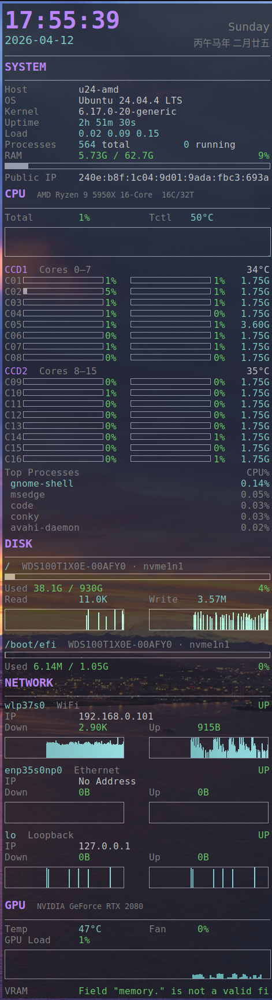

# Conky System Monitor

Auto-generated Conky configuration that adapts to any Ubuntu desktop. Detects hardware on each boot and produces a tailored system monitor panel.



## Features

- **Auto-detection** — CPU (model, cores, threads, CCD topology), disks, NICs, GPU (NVIDIA), display resolution, temperatures, proxy
- **Dynamic hwmon** — scans `/sys/class/hwmon/` every run so sensor indices never go stale
- **Display scaling** — all fonts, bars, graphs, and positions scale to the screen resolution (4K = 1.0x baseline)
- **Color schemes** — 7 built-in themes (orange, cyan, green, purple, blue, red, teal); one is picked at random on each restart, or you can pin one
- **Device blacklist** — skip specific disks or NICs via a simple config file
- **CCD grouping** — AMD Ryzen CCDs detected automatically via L3 cache topology; Intel CPUs fall back to a flat core list
- **SMT-aware** — dual-bar layout for Hyper-Threading / SMT; single-bar for non-SMT CPUs

## Quick Start

```bash
# Clone the repo
git clone <repo-url> ~/conkyrc
cd ~/conkyrc

# Run once (random color scheme)
./start_conky.sh

# Run with a specific color scheme
./start_conky.sh --scheme cyan
```

The script generates `~/.config/conky/conky.conf` and starts conky in the background.

## Autostart on Boot

### GNOME autostart

Run the installation script to automatically set up autostart with the correct path for your system:

```bash
./install_autostart.sh
```

The script will:
1. Detect your current installation directory
2. Create `~/.config/autostart` if it doesn't exist
3. Install the properly configured desktop file

Conky will start automatically on your next boot.

### Crontab

Crontab (cron table) is a built-in Linux scheduler. Each user has their own crontab file listing commands to run automatically — on a schedule or at system startup. No extra software needed; it comes with every Ubuntu install.

```bash
crontab -e

# Add this line at the end of the file, then save and quit (:wq)
@reboot sleep 5 && /path/to/conkyrc/start_conky.sh

# Verify it was saved
crontab -l
```

The 5-second delay ensures the desktop environment is fully loaded before conky starts.

## Blacklist

Edit `blacklist.conf` to hide devices you don't want displayed:

```
# Format: type:name
disk:nvme0n1       # skip Windows drive
nic:docker0        # skip docker bridge
nic:br-abcdef      # skip bridge interfaces
nic:veth1234       # skip container veth
```

Supported types: `disk`, `nic`.

### Per-Host Blacklist

When sharing the repo across multiple PCs via git, use per-host override files
to avoid conflicts. The generator automatically loads `blacklist-<hostname>.conf`
and merges it with the base `blacklist.conf`:

- **`blacklist.conf`** — common entries shared across all PCs (tracked in git)
- **`blacklist-<hostname>.conf`** — per-PC overrides (gitignored)

```bash
# Find your hostname
hostname

# Create a per-host override
cp blacklist.conf blacklist-$(hostname).conf
# Edit it with PC-specific entries (e.g. Windows drives, extra NICs)
```

The per-host files are gitignored (`blacklist-*.conf` in `.gitignore`), so each
PC keeps its own blacklist without interfering with git sync.

## Color Schemes

| Name | Accent |
|------|--------|
| orange | `#ff8c00` |
| cyan | `#00bcd4` |
| green | `#4caf50` |
| purple | `#bb86fc` |
| blue | `#42a5f5` |
| red | `#ef5350` |
| teal | `#26a69a` |

Pass `--scheme NAME` to pin a scheme, or omit for random selection on each restart.

## Dependencies

- **conky** (1.19+, built with Xft and optionally nvidia support)
- **Python 3** (for `generate_conky.py` and `lunar.py`, no pip packages needed)
- **nvidia-smi** (optional, for GPU section)
- **curl** (for public IP lookup)
- CJK font such as `Noto Sans CJK SC` (optional, for Chinese lunar calendar)

## Scaling Reference

The layout is designed at 3840x2160 (scale 1.0). Font sizes at reference:

| Role | Size |
|------|------|
| Body | 12 |
| Header | 15 |
| Subtitle | 10 |
| Clock | 31 |

On other resolutions, everything scales proportionally by `screen_height / 2160`.
